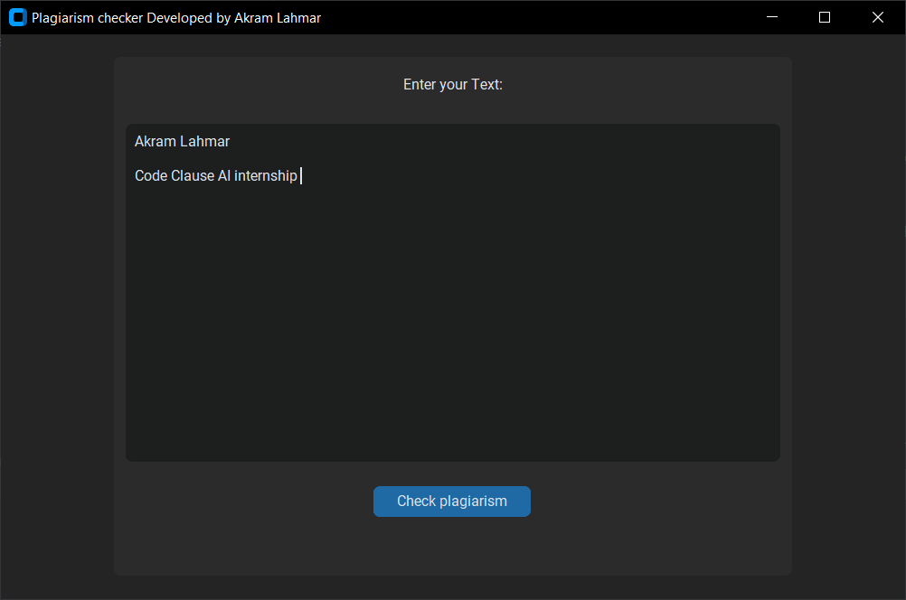

# CodeClause-Ai-Internship-Plagiarishm-checker

# Code Clause AI Internship

This project is a plagiarism checker developed by Akram Lahmar using Python and the Tkinter library. It calculates the cosine similarity between a user's input text and a database of text to determine the degree of similarity.

## Getting Started

To use this project, follow the instructions below:

1. Make sure you have Python installed on your system.
2. Clone or download the project repository.
3. Install the required dependencies by running the following command:

pip install -r requirements

4. Run the `main.py` file to launch the plagiarism checker application.

## Prerequisites

Before running the project, ensure that you have the following prerequisites:

- Python 3.x
- Tkinter library
- customtkinter library

## Usage

1. Launch the application by running the `main.py` file.
2. The application window will open with a text input field labeled "Enter your Text."
3. Enter your text in the provided text box.
4. Click the "Check plagiarism" button to calculate the cosine similarity between your input text and the database.
5. A message box will display the result, indicating the percentage of match between your input text and the database.

## Algorithm

The plagiarism checker uses the cosine similarity algorithm to calculate the similarity between two texts. It follows the steps below:

1. Retrieve the user's input text from the text box.
2. Calculate the term frequency (TF) for each word in the input text and the database text.
3. Calculate the dot product of the query term frequency (query_tf) and the database term frequency (database_tf).
4. Calculate the magnitude of the query vector and the database vector.
5. Calculate the cosine similarity by dividing the dot product by the product of the query vector magnitude and the database vector magnitude.
6. Multiply the cosine similarity by 100 to get the match percentage.
7. Display the match percentage in a message box.

## Author

This project is developed by Akram Lahmar as part of the Code Clause AI Internship program.

